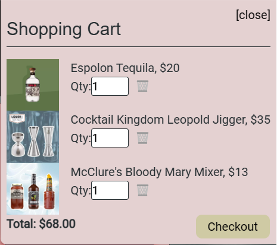

# **MixMuse**

## **Description**

This MERN full stack e-commerce web application is built with React and the open source JavaScript library Redux, which remains the industry standard for managing complex state in a large-scale React application. 

MixMuse is a scalable, user-focused MERN app that offers a wide range of bartending supplies such as liquor, equipment and mixers. Age verification is required to enter the site. The app leverages Redux's powerful capabilities to handle global state, ensuring a seamless shopping experience. The Redux store orchestrates data flow, while a Redux provider grants access to this central state. This architecture enables precise control over state changes and data extraction, ensuring that actions are dispatched effectively throughout the app.

## **Table of Contents**
- [Technology Used](#technology-used)
- [Installation](#installation)
- [Usage](#usage)
- [Link to deployed app via heroku](#link-to-deployed-app-via-heroku)
- [GitHub Repository](#github-repository)
- [Credits](#credits)
- [Contribute](#contribute)
- [License](#license)
- [Questions](#questions)

 ## **Technology Used**
* MERN full stack application
* Deployed using Heroku (with data).
* React for the front end
* Redux, React-redux
* MongoDB and the Mongoose ODM for the database.
* GraphQL with a Node.js and Express.js server, and apolloserver to interface with GraphQL
* Includes authentication (JWT)
* Stripe payment platform
* Age Verification
* Responsive sizing with mobile-first approach; bootstrap framework
* Is installable and uses a service worker for offline functionality

## **Installation**

- npm i (to install all dependencies)
- npm start (to start the app)

## **Usage**

**Age Verification Page:**  

 

**Landing Page:**  

 

**Main Product Page:**  

 

**Cart:**  

  

 

**Product Detail and Ratings Page:**  

 

## **Link to deployed app via heroku**

Deployed Link: https://mixmuse-b1c9f2067218.herokuapp.com/

## **GitHub Repository** 
  [github.com/c0nstantin1990/MixMuse](https://github.com/c0nstantin1990/MixMuse)

## **Credits**
Primary developers: 
* Constantin Constantinov
* Josh Hebert
* Ashley Fernandez
* Donna Thompson

UNCC Textbook, Stack Overflow, GitHub.

[Redux documentation](https://redux.js.org/)

Other online documentation for React-redux, React components and packages, animation, svg files, bootstrap, css, responsive sizing and more.

## **Contribute**
If you would like to contribute to this app, please submit contributions to the email(s) below.

## **License**
Licensed under [The MIT License](https://opensource.org/licenses/MIT).

## **Questions**
Please contact the developers at constantinov.constantin@gmail.com, jhebertcocktails@gmail.com, ashleyemfernandez@gmail.com, or dlthompson7@icloud.com to report issues, contribute, or if you have additional questions.
